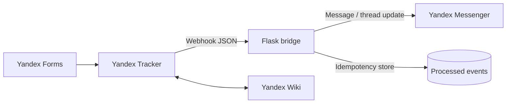

# Operations automation: Yandex Tracker → Messenger

> An anonymised portfolio case based on an internal-process automation project. It demonstrates the requirements, integration design, and a runnable reference implementation; it does **not** include production code, credentials, or company data.

  

## Problem

A construction company coordinated procurement, finance, accounting, and delivery-control requests in Telegram/WhatsApp, spreadsheets, and personal messages. Requests were hard to track; hand-offs, files, and status updates were easily lost.

## Solution

The target operating model made **Yandex Tracker** the source of truth while preserving a familiar chat experience. Yandex Forms captured structured requests; Tracker workflows and triggers routed them; a small Flask service consumed webhook events and sent concise updates to the relevant **Yandex Messenger** chat and thread.



## My role

- Analysed AS-IS and designed TO-BE routes for procurement, invoice approval, payment, delivery control, and administrative requests.
- Formalised user stories, acceptance criteria, statuses, local fields, triggers, and hand-off rules for business and project teams.
- Defined integration behaviour for Tracker, a Flask backend, Messenger Bot API, and Wiki; validated JSON payloads, attachments, message/thread identifiers, and retry safety.
- Organised end-to-end acceptance checks in `TESTG` before rollout to the `OPS` production queue; reconciled documented rules with actual workflow behaviour.

## Outcome

The organisation moved from fragmented coordination to a shared task workflow with visible owners, statuses, deadlines, and context-aware chat notifications. Internal estimates for priority processes indicated 25–30% faster request/invoice progression, on-time execution improving from roughly 45% to 70%+, and fewer manual clarifications. These figures are directional internal estimates, not independently audited results.

## What is in this repository

| Area | Contents |
| --- | --- |
| Architecture | [system design](docs/ARCHITECTURE.md), boundaries, data flow, operational safeguards |
| BPMN process | [public process model](docs/PROCESS_MODEL.md): procurement → finance → accounting → delivery control |
| API design | [webhook contract](docs/API_CONTRACT.md) and anonymised payloads |
| Working sample | Flask webhook endpoint, message routing, signature check, idempotency |
| Quality | pytest scenarios for create, status change, attachment and duplicate delivery |
| Product artefacts | [requirements and acceptance criteria](docs/REQUIREMENTS.md), [test strategy](docs/TEST_STRATEGY.md), [risks](docs/RISKS.md) |

## Quick start

```bash
python -m venv .venv
source .venv/bin/activate
pip install -r requirements-dev.txt
cp .env.example .env
set -a && source .env && set +a
pytest
PYTHONPATH=src flask --app tracker_bridge.app run --debug
```

The sample deliberately uses an in-memory event store and a logging messenger client. Replace them with durable storage and the official API client before using this pattern in production.

## Repository structure

```text
docs/       architecture, contract, requirements, testing and risks
examples/   safe sample webhook payloads
src/        minimal Flask reference implementation
tests/      executable acceptance scenarios
```

## Scope and confidentiality

Names, IDs, queues, fields, attachments, routes, and payload values are anonymised. The repository is a portfolio reconstruction of integration patterns and analysis artefacts, not a deployable copy of an employer’s system.

## Stack

`Yandex Tracker` · `Yandex Forms` · `Yandex Messenger` · `Yandex Wiki` · `Python` · `Flask` · `Webhooks` · `JSON` · `pytest` · `BPMN / AS-IS / TO-BE`
