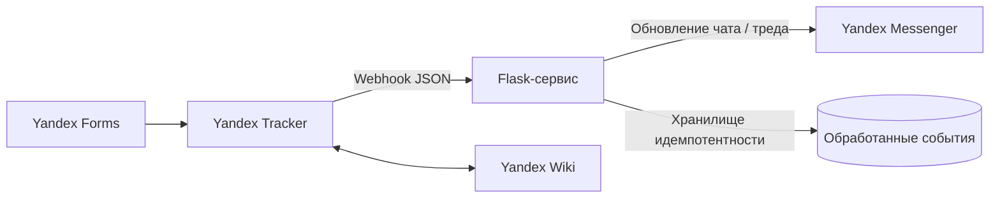

# Автоматизация операционных процессов: Yandex Tracker → Messenger

> Обезличенный портфельный кейс по автоматизации внутренних процессов. Репозиторий показывает требования, интеграционную архитектуру и запускаемый пример; в нём нет production-кода, учётных данных и данных компании.

  

## Проблема

Строительная компания координировала заявки на снабжение, финансы, бухгалтерию и контроль поставки в Telegram/WhatsApp, таблицах и личных сообщениях. Было трудно отслеживать заявки; на стыках терялись файлы, статусы и ответственность.

## Решение

Целевая операционная модель сделала **Yandex Tracker** единым источником статуса задачи, сохранив привычный чатовый формат. Yandex Forms собирали структурированные заявки, маршруты и триггеры Tracker направляли их по процессу, а небольшой Flask-сервис принимал webhook-события и отправлял краткие обновления в нужный чат и тред **Yandex Messenger**.



## Моя роль

- Анализировал AS-IS и проектировал TO-BE маршруты для снабжения, согласования счёта, оплаты, контроля поставки и административных заявок.
- Формализовал user stories, критерии приёмки, статусы, локальные поля, триггеры и правила передачи задач для бизнес- и проектных команд.
- Описал интеграционную логику Tracker, Flask backend, Messenger Bot API и Wiki; проверял JSON-payloads, вложения, идентификаторы сообщений/тредов и защиту от повторной обработки.
- Организовал end-to-end приёмку в `TESTG` перед rollout в боевую очередь `OPS`; сверял документированные правила с фактической работой маршрутов.

## Результат

Компания перешла от разрозненной координации к единому контуру задач с видимыми ответственными, статусами, сроками и контекстными уведомлениями в чатах. По внутренней оценке приоритетных процессов срок прохождения заявок и счетов сократился на 25–30%, доля задач, выполненных в срок, выросла примерно с 45% до 70%+, а количество ручных уточнений снизилось.

## Что внутри репозитория

| Раздел | Содержание |
| --- | --- |
| Архитектура | [системный дизайн](docs/ARCHITECTURE.md), границы, поток данных и надёжность |
| BPMN-процесс | [публичная модель процесса](docs/PROCESS_MODEL.md): снабжение → финансы → бухгалтерия → контроль поставки |
| API | [контракт webhook](docs/API_CONTRACT.md) и обезличенные payloads |
| Рабочий пример | Flask endpoint, маршрутизация сообщений, проверка подписи и идемпотентность |
| Качество | pytest-сценарии создания, смены статуса, вложений и повторной доставки |
| Аналитические артефакты | [требования и критерии приёмки](docs/REQUIREMENTS.md), [стратегия тестирования](docs/TEST_STRATEGY.md), [риски](docs/RISKS.md) |

## Быстрый запуск

```bash
python -m venv .venv
source .venv/bin/activate
pip install -r requirements-dev.txt
cp .env.example .env
set -a && source .env && set +a
pytest
PYTHONPATH=src flask --app tracker_bridge.app run --debug
```

В примере используются in-memory хранилище событий и logging-клиент Messenger, чтобы код можно было безопасно запустить локально.

## Структура репозитория

```text
docs/       архитектура, контракт, требования, тестирование и риски
examples/   безопасные примеры webhook-payloads
src/        минимальная реализация на Flask
tests/      исполняемые сценарии приёмки
```

## Конфиденциальность

Названия, ID, очереди, поля, вложения, маршруты и значения payloads обезличены. Репозиторий — портфельная реконструкция интеграционных паттернов и аналитических артефактов, а не копия системы работодателя.

## Стек

`Yandex Tracker` · `Yandex Forms` · `Yandex Messenger` · `Yandex Wiki` · `Python` · `Flask` · `Webhooks` · `JSON` · `pytest` · `BPMN / AS-IS / TO-BE`
