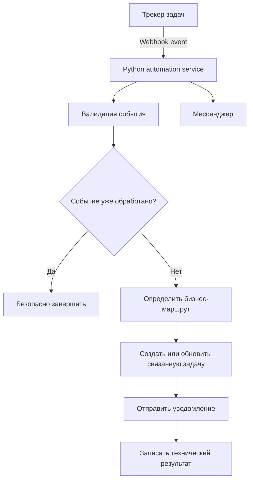

# Architecture

## Концептуальная схема

## Ответственность Python-сервиса

Сервис не принимает бизнес-решения за пользователя. Он обеспечивает повторяемое исполнение формализованных правил: принимает событие, не допускает дублей, определяет маршрут, формирует связанные сущности и передаёт уведомление.

Папка `src` содержит безопасную учебную реализацию этой логики на Python без сетевых вызовов и секретов.
