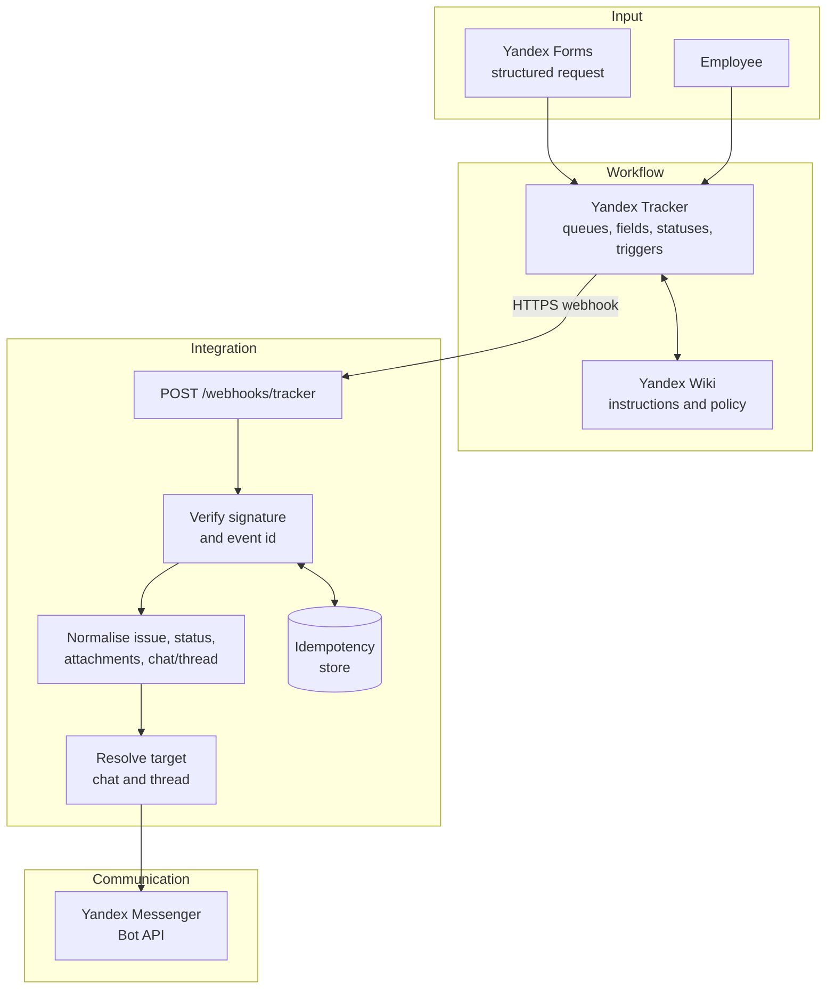

# Architecture

## Design principle

Tracker owns the workflow state. The bridge does not decide whether an invoice is approved or mutate Tracker records: it turns already-authorised Tracker events into clear, correctly routed chat updates.

## Event lifecycle

1. A structured form or employee creates/updates an issue in Tracker.
2. Tracker workflow validates fields, changes state, and emits an event.
3. The bridge authenticates the request, rejects malformed payloads, and claims its event ID.
4. It extracts the issue key, summary, status, attachments, functional block, and saved chat/thread context.
5. Routing selects the project/functional chat and reuses the existing thread when present.
6. The bot posts one compact update; the event is retained as processed to make retries safe.

## Boundaries

| Component | Responsibility | Not responsible for |
| --- | --- | --- |
| Forms | Capture mandatory request data | Workflow approval |
| Tracker | State machine, access, task history, triggers | Message formatting/delivery |
| Flask bridge | Verify, normalise, route, deduplicate, deliver | Business approval decisions |
| Messenger | Timely human-facing notification and discussion | System-of-record storage |
| Wiki | Rules, templates, operating instructions | Event processing |

## Reliability and security

- TLS termination and a shared webhook secret are required; reject unauthenticated requests.
- Event ID is persisted before sending. A production store should be transactional and have an expiry policy.
- Retries are safe: an already-claimed event returns `duplicate` without another message.
- Secrets belong only in environment variables; payload logs must redact tokens, personal data, and file URLs.
- Failed deliveries require structured logs, alerting, and a replay path; no silent loss of a workflow event.

