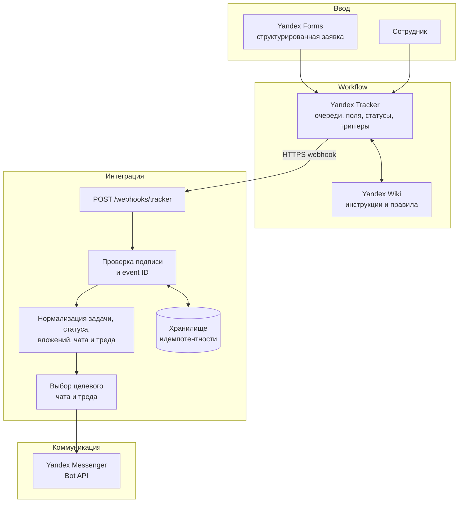

# Архитектура

## Принцип проектирования

Yandex Tracker владеет состоянием workflow. Bridge не принимает решение о согласовании и не меняет задачу: он превращает уже авторизованные события Tracker в понятные, корректно направленные обновления в чате.

## Жизненный цикл события

1. Структурированная форма или сотрудник создаёт либо обновляет задачу в Tracker.
2. Workflow Tracker валидирует поля, меняет статус и отправляет событие.
3. Bridge аутентифицирует запрос, отклоняет некорректный payload и резервирует `event_id`.
4. Он извлекает ключ задачи, название, статус, вложения, функциональный блок и сохранённый контекст чата/треда.
5. Маршрутизация выбирает чат процесса и при наличии использует прежний тред.
6. Бот публикует компактный апдейт; событие помечается обработанным, поэтому повторная доставка безопасна.

## Границы компонентов

| Компонент | Отвечает за | Не отвечает за |
| --- | --- | --- |
| Forms | Обязательные данные заявки | Согласование по workflow |
| Tracker | Статусы, права, историю, триггеры | Форматирование и доставку сообщений |
| Flask bridge | Проверку, нормализацию, маршрутизацию, дедупликацию и доставку | Бизнес-решения по заявке |
| Messenger | Оперативное уведомление и обсуждение | Хранение системного статуса |
| Wiki | Инструкции, шаблоны и правила | Обработку событий |

## Надёжность и безопасность

- Нужны TLS и shared secret webhook; неаутентифицированные запросы отклоняются.
- `event_id` сохраняется до отправки. В production потребуется транзакционное хранилище и политика истечения записей.
- Повторная доставка безопасна: для уже занятого `event_id` возвращается `duplicate` без нового сообщения.
- Секреты хранятся только в переменных окружения; из логов исключаются токены, персональные данные и URL файлов.
- Ошибки доставки должны попадать в структурированные логи, мониторинг и сценарий повтора.
