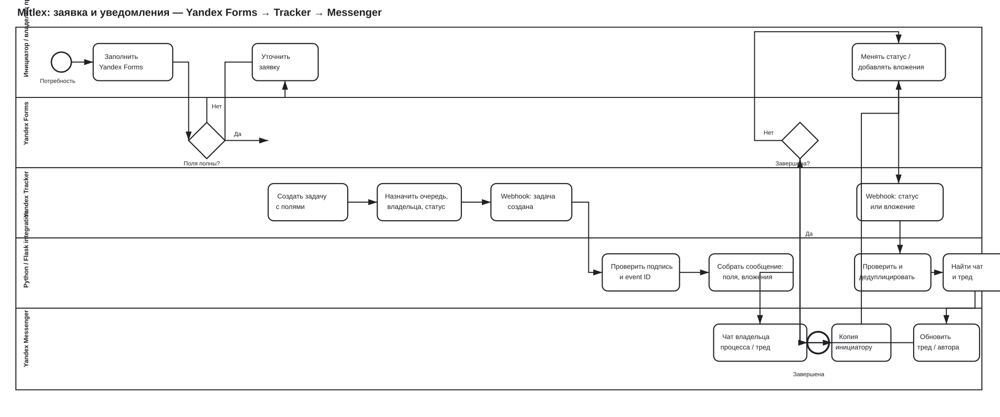

# BPMN-модель: заявка и уведомления

Это обезличенная публичная версия TO-BE процесса, построенного для Mitlex. Исходник соответствует BPMN 2.0 и редактируется в Camunda Modeler.

[Открыть исходник BPMN для Camunda Modeler](diagrams/mitlex_procurement_to_payment.bpmn)

## Что отражает модель

1. Инициатор заполняет Yandex Forms по стандартизированным полям: тип заявки, объект/проект, срок, вложения и функциональный блок.
2. Неполная заявка возвращается на уточнение до создания задачи.
3. Yandex Tracker создаёт задачу, назначает очередь, владельца и стартовый статус. Это единый источник учёта процесса.
4. Событие о создании задачи попадает в Python/Flask bridge. Сервис проверяет подпись и `event_id`, формирует безопасный текст сообщения и не раскрывает ссылки на вложения.
5. Messenger получает первое сообщение в чате владельца процесса; инициатор получает его дубликат.
6. При смене статуса или добавлении вложения Tracker отправляет отдельное webhook-событие. Bridge дедуплицирует его, находит сохранённый чат и тред, затем публикует апдейт в том же контексте и инициатору.
7. До завершения задачи цикл обновлений повторяется. Решения по заявке принимают владельцы процесса в Tracker, а не интеграционный сервис.

## Границы автоматизации

| Этап | Ответственность workflow | Ответственность интеграции |
| --- | --- | --- |
| Создание заявки | Forms собирает обязательные входные данные | Не принимает бизнес-решения и не меняет форму |
| Маршрутизация | Tracker создаёт задачу, хранит статус, владельца и историю | Использует разрешённые поля для сообщения |
| Первое уведомление | Владелец процесса получает контекст заявки | Bridge проверяет событие, форматирует текст и отправляет его в нужный чат |
| Статус и вложения | Пользователи меняют состояние и добавляют файлы в Tracker | Bridge сохраняет контекст треда, защищает от повторной доставки и сообщает об изменении |
| Завершение | Tracker фиксирует итог и ответственность | Messenger остаётся каналом коммуникации, а не системой учёта |

## Зачем здесь BPMN

Модель позволила согласовать роли, точки передачи, возвраты на уточнение, развилки и границы автоматизации до настройки маршрутов и webhook-логики. На её основе формировались user stories, критерии приёмки, статусы Tracker и end-to-end сценарии тестирования.
