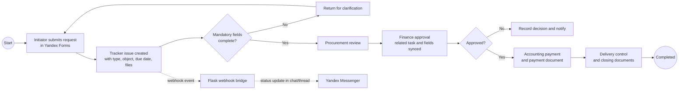

# Process model: procurement request to payment

This is a simplified, anonymised public representation of a process modelled in BPMN during the project. It communicates the business hand-offs and automation boundaries without disclosing internal rules, names, or identifiers.

## Automation boundaries

| Stage | Workflow responsibility | Integration responsibility |
| --- | --- | --- |
| Request | Tracker stores a structured source-of-truth issue | Form supplies required inputs |
| Finance hand-off | Trigger creates/links a financial task and synchronises permitted fields | Bridge posts an update to the relevant discussion |
| Approval / rejection | Authorised employee makes the decision in Tracker | Bridge reports the status; it does not decide it |
| Payment documents | Accounting attaches confirmation and moves state | Bridge preserves chat/thread context for the update |
| Completion | Tracker records completion and ownership | Messenger remains a communication layer, not a record system |

## Why BPMN was useful

The model made ownership, hand-offs, gateway decisions, exceptions, and automation points discussable with procurement, finance, accounting, IT, and project teams before implementation. It also provided the basis for user stories, acceptance tests, Tracker statuses, and webhook scenarios.
